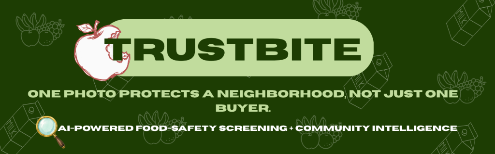

<div align="center">

<!-- Replace this with your exported Canva banner (1280x400px). Save it as assets/trustbite-banner.png in your repo root. -->


# TrustBite 🌱

**One photo protects a neighborhood, not just one buyer.**

[](https://trustbite.onrender.com/)
[](#)
[](#)
[](#)

</div>

---

## The problem

Meera buys milk from her regular vendor. Today, it smells a little off — but she has no way of knowing if that's just her batch, or if half her street has run into the same thing this week. She has no lab access, no time to wait for a government inspection, and no way to warn her neighbors even if she wanted to.

This happens every day, in every unorganized market, to people who have no accessible way to verify what they're buying — until it's already made someone sick.

## The insight

**A photo can't smell milk.** No legitimate AI can prove adulteration from a single image alone — and we're not going to pretend otherwise. But a photo, combined with self-reported context, combined with what dozens of other people nearby have already noticed — that's a real signal. That combination is what TrustBite is built around.

## What TrustBite actually does

TrustBite is a localized food-safety intelligence platform, built around a multi-stage AI pipeline that separates visual signals from community intelligence:

| Layer | What it does |
|---|---|
| 🔍 **Input Validation** | Rejects non-food items, checks image quality, and detects category mismatches before any safety screening occurs. |
| 👁️ **Visual Screening** | Uses **Google Gemini 2.0 Flash Vision API** to analyze the food item for visible anomalies (e.g., discoloration, unusual texture). |
| 🗣️ **User Context** | Captures sensory details (smell, texture) that a photo cannot capture. |
| 📍 **Community Intelligence** | Aggregates nearby reports using geographic distance, calculates temporal trends (24h/7d), and detects unusual spikes or hotspots. |
| ⚡ **Risk Synthesis** | Combines all signals into an explainable "TrustBite Signal" with clear evidence provenance (Visual + Sensory + Community + Time). |

Every result is labeled exactly for what it is: **a screening aid, not a lab-grade verdict.** We'd rather be honest and useful than impressive and wrong.

---

## ✨ Features

- 📸 Photo-based screening for dairy and fruits/vegetables
- 🗣️ Quick category-specific sensory questionnaire to strengthen the AI's read
- 🗺️ Live, interactive map of India showing community-reported risk hotspots
- 📊 Real-time local stats — see how many scans and reports have come from your area
- 🕓 Personal scan history
- 🌍 Locality-based public news/recall cross-referencing
- 💧 Clean glassmorphism UI with lightweight `.lottie` motion, built mobile-first

---

## 🛠️ Tech Stack

### Frontend
- **React.js (via Vite):** High-performance UI library and build tool
- **Tailwind CSS:** Utility-first styling, glassmorphism effects, and responsive design
- **React Router:** Seamless single-page application (SPA) navigation
- **Leaflet & React-Leaflet:** Interactive map of India, plotting high-risk zones
- **Lucide React:** Clean, modern vector icons
- **LottieFiles / dotLottie-React:** Lightweight, high-quality `.lottie` animations

### Backend
- **Node.js & Express.js:** REST API framework, orchestrating the intelligence pipeline
- **Google Gemini API:** Real vision-based food screening using `gemini-2.0-flash`
- **Multer:** Middleware for handling multipart/form-data (image uploads)
- **SQLite3:** Lightweight relational database with geographic indexing
- **Intelligence Services:** Custom backend engines for Input Validation, Community Aggregation, Risk Synthesis, and Anomaly Detection

### Deployment & Tools
- **Render:** Full-stack deployment hosting the Express server and React static build
- **Git & GitHub:** Version control and source code management

---

## 🌐 Live Demo

**👉 [trustbite.onrender.com](https://trustbite.onrender.com/)**

> Hosted on Render's free tier — the server may take 30-60 seconds to spin up on first load if it's been idle. Thanks for your patience while it wakes up! ☕

---

## 🚀 Running Locally

**1. Clone the repository**
```bash
git clone https://github.com/MuskanGupta1903/trustbite.git
cd trustbite
```

**2. Install dependencies**
```bash
cd frontend && npm install
cd ../backend && npm install
```

**3. Set up environment variables**
Create a `.env` file in the `backend` directory (see `backend/.env.example`):
```bash
GEMINI_API_KEY=your_gemini_api_key_here
```

**4. Run the backend**
```bash
cd backend
npm start
```

**5. Run the frontend** (in a separate terminal)
```bash
cd frontend
npm run dev
```

**5. Open the app**
Visit `http://localhost:5173` (or whichever port Vite assigns) in your browser.

---

## 👥 Team

Built by two people who got tired of not knowing if the milk was actually fine.

| | |
|---|---|
| 🧑‍💻 **Muskan Gupta** | [@MuskanGupta1903](https://github.com/MuskanGupta1903) |
| 🧑‍💻 **Vaibhav** | [@vintech018](https://github.com/vintech018) |

---

## 🗺️ Roadmap

- [ ] Multi-category support (grains, spices, packaged goods)
- [ ] Municipal/authority dashboard for verified hotspot routing
- [ ] SMS/IVR reporting channel for non-smartphone users
- [ ] Regional language support
- [ ] Push notifications for new reports in saved localities

---

<div align="center">

*Built for Tech Eximius 2026 — Artificial Intelligence & Machine Learning track.*

</div>
